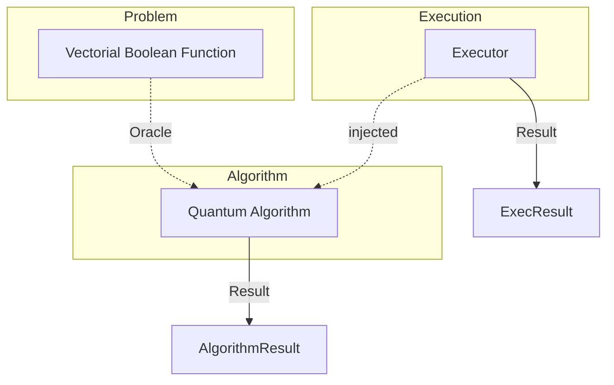

<!--
Copyright 2026 Fraunhofer AISEC

Licensed under the Apache License, Version 2.0 (the "License");
you may not use this file except in compliance with the License.
You may obtain a copy of the License at

    http://www.apache.org/licenses/LICENSE-2.0

Unless required by applicable law or agreed to in writing, software
distributed under the License is distributed on an "AS IS" BASIS,
WITHOUT WARRANTIES OR CONDITIONS OF ANY KIND, either express or implied.
See the License for the specific language governing permissions and
limitations under the License.
-->
# QACE

**Quantum-Assisted Cryptanalytic Exploration** is a toolkit for investigating cryptanalytic problems using quantum
computing capabilities.

The SDK provides a framework for analyzing classical ciphers, S-boxes, and Boolean functions using quantum algorithms.
It integrates three components into a coherent workflow: a model of the analysis target, a corresponding quantum
algorithm, and the execution of the resulting circuit on a backend. Because these three layers are clearly separated,
each component can be exchanged independently, ranging from a local simulator to physical IBM Quantum hardware, without
modifying the algorithm itself.

For more information, see the [documentation](https://fraunhofer-aisec.github.io/qace-sdk/).

## The Three Layers

The SDK is designed as a framework. Each layer defines an abstract interface and a set of base classes; the components
listed below are reference implementations illustrating how the respective abstractions can be realized. Users are
expected to extend these layers with their own implementations.

- **VBF Layer.** Defines an abstract representation of vectorial Boolean functions, which serve as the cryptanalytic
  targets under investigation. Any function that conforms to this interface can be analyzed. The provided
  implementations, including S-boxes, XOR ciphers, lookup tables, and both random and deliberately biased functions, are
  examples of such targets.
- **Algorithm Layer.** Defines an abstract quantum algorithm that operates on a target and produces a structured result.
  It establishes the common contract shared by all algorithms. The provided implementations, such as Correlation
  Extraction, Amplitude Amplification, Preimage search, and SITH, are examples that build on this abstraction.
- **Execution Layer.** Defines an abstract interface for executing quantum circuits, decoupling algorithms from any
  particular backend. The provided implementations, including the Aer simulator, the IBM Quantum Runtime, and an
  iterative executor, are examples of concrete backends.

Each algorithm constructs its circuit and delegates execution to an injected `CircuitExecutor`. This design keeps the
algorithm logic fully decoupled from the backend and allows every layer to be exchanged or extended independently.

## Architecture


## Installation
Regardless of whether qace is installed via pip or from source,
we encourage the user to use a virtual environment.
### From PyPI Package
```bash
python -m venv .venv
source .venv/bin/activate
pip install qace
```

### From Source
```bash
git clone https://github.com/Fraunhofer-AISEC/qace-sdk.git
cd qace-sdk
python -m venv .venv
source .venv/bin/activate
make install
```

Requires Python ≥ 3.12.

## Usage Example

```python
from qace.vbf import rijndael_s_box
from qace.algorithm import CorrelationExtraction
from qace.execution import AerExecutor

executor = AerExecutor.default()
cea = CorrelationExtraction(executor=executor, vbf=rijndael_s_box)
result = cea.run()

print(result.mask_pairs)
```

## Running Tests

Tests use [pytest](https://docs.pytest.org/):

```bash
make test              # install (with test extras) and run all tests
```

or

```bash
make install
pytest tests/execution/  # run a specific module
```

## Documentation

The docs are built with [MkDocs](https://www.mkdocs.org/):

```bash
make docs-serve   # live-reload server at http://127.0.0.1:8000
make docs-build   # static HTML in site/
```

Documentation dependencies are declared under the `docs` extra in `pyproject.toml`
(`pip install -e ".[docs]"`).

## Status

| Layer | State |
|---|---|
| Execution | implemented & tested |
| Algorithm | implemented & tested |
| VBF | implemented & tested |

The API is still evolving and may change before the first stable release.

## License

Apache-2.0 — see the [LICENSE](https://github.com/Fraunhofer-AISEC/qace-sdk/blob/main/LICENSE) file, or contact the authors for details.

## Contact
For questions or feedback:
- qace-sdk@aisec.fraunhofer.de

For bugs and feature requests:
- Please create an issue in the repository

## Acknowledgements

 We thank the Bavarian Ministry of Economic Affairs, Regional Development and Energy,
 with funds from the Hightech Agenda Bayern, for funding the theoretical work (SITH-Algorithm) as part of the
 BayQS project. Furthermore, we thank the Munich Quantum Valley,  which is supported by the
 Bavarian state government, with funds from the Hightech Agenda
 Bayern Plus, for funding the implementation of the QACE-SDK as part of the QACI project.